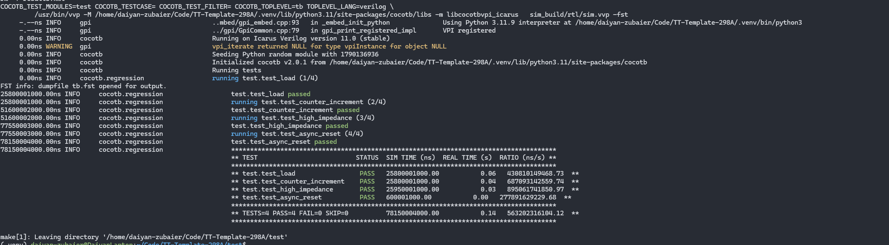
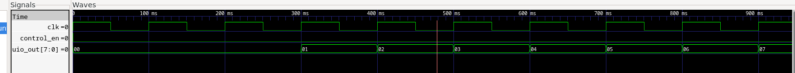
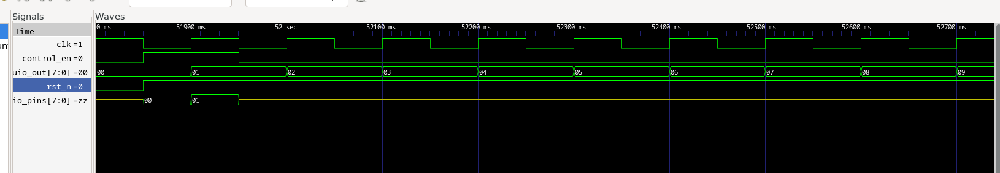
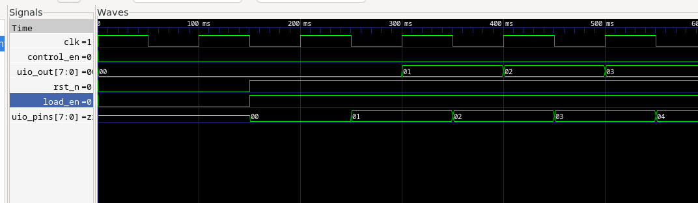

<!---

This file is used to generate your project datasheet. Please fill in the information below and delete any unused
sections.

You can also include images in this folder and reference them in the markdown. Each image must be less than
512 kb in size, and the combined size of all images must be less than 1 MB.
-->

## How it works

It is a 8 bit counter with async reset (rst_n), sync load (controlled via an enable ui_in[0]) and a tri state output with the control bit being (ui_in[1]).

## How to test

```bash
cd test
make
```

Example output:


Counter incrementing gtkwave


Hi-Z:

See yellow line in uio_pins after falling edge of control_en pin.

You might notice this:

and think, hmmm... this looks wrong. Well it's reading from the testbench driver, both the chip driver and test bench driver share the same output pins. If you keep scrolling over to the high impeadence test you'll see correct behaviour (see ss above).


## External hardware

No external hardware was used
